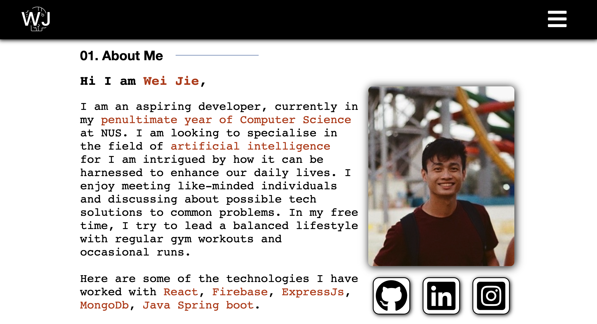

# My Personal Portfolio website
This repository contains the source code for my personal portfolio, designed to showcase my skills, experience, and projects. It's built using React, CSS, and HTML, and incorporates additional libraries such as Framer Motion for animations and React Icons for scalable vector icons.

Site link: https://ongweijie7.github.io/Portfolio/

## Technologies Used
React, CSS, HTML, Framer Motion

 

